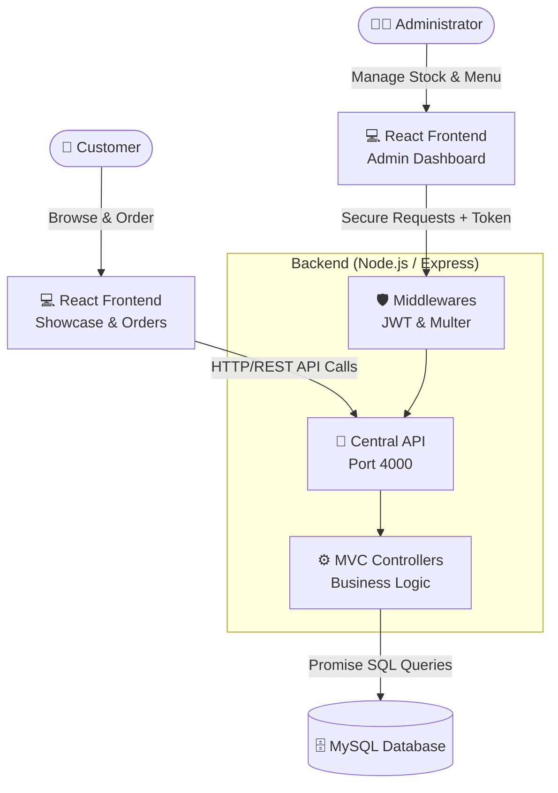

# ☕ Coffee Shop Management Platform


A complete "Full-Stack" management and showcase solution for a coffee shop or restaurant. This project is divided into three main parts: an elegant client interface, a comprehensive administrator dashboard, and a robust backend API.

## 🔗 Live Demo
* **🌍 Site Client (Vitrine & Menu) :** [(https://coffee-shop-platform-client.vercel.app](https://coffee-shop-platform-sepia.vercel.app/)) 

---

## 🏗️ Architecture Diagram

The application follows a modern decoupled architecture (Client/Server) based on the MVC pattern for the backend:



---

## 🌟 Features

### 📱 Client Side (Frontend)
- **Interactive Menu:** Browse coffees, teas, pastries, crepes, and juices. *(Static version without backend available!)*
- **Table Reservation:** Book your seat and specify special requests.
- **Profile Management:** Registration, secure login, and profile updates.
- **Order History:** Add items to the cart and place orders from the table.
- **Responsive Design:** Modern, beautiful, and mobile-friendly interface.

### 💼 Administrator Side (Dashboard)
- **Dashboard:** Overview of statistics (revenue, orders, reservations, low stock alerts).
- **Menu & Pack Management:** Add, modify, or delete products and create bundled offers.
- **Stock Management:** Track ingredient consumption in real-time.
- **Order Management:** Validate orders and collect payments.
- **Reservations & Events Management:** Accept/Reject reservations. The system automatically closes events if maximum capacity is reached!

### ⚙️ Backend Side (API)
- **MVC Architecture:** Clean, modular, and scalable code (Model-View-Controller).
- **Security:** JWT Token authentication and hashed passwords with `bcrypt`.
- **Image Uploads:** Local management of menu and event images using `multer`.
- **Relational Database:** Comprehensive and optimized MySQL schema.

---

## 📂 Project Structure

```text
coffee-shop-platform/
├── client/          # React Application (Client Showcase)
├── admin/           # React Application (Administrator Dashboard)
├── server/          # Node.js & Express API (Centralized Backend)
├── coffee_shop.sql  # MySQL Database Export File
└── .github/         # CI/CD Pipelines (GitHub Actions)
```

---

## 🚀 Local Installation & Setup

### Prerequisites
- [Node.js](https://nodejs.org/) (v18+)
- [XAMPP](https://www.apachefriends.org/) or a local MySQL server.

### 1. Database Setup
1. Start Apache and MySQL via XAMPP.
2. Go to `http://localhost/phpmyadmin`.
3. Create a new database named `coffee_shop`.
4. Import the provided `coffee_shop.sql` file located in the project root.

### 2. Start the Backend (API)
Open a terminal in the `server/` folder:
```bash
cd server
npm install
# Create a .env file (see Configuration section)
npm run dev
```
*The API will run on `http://localhost:4000`*

### 3. Start the Client
Open a second terminal in the `client/` folder:
```bash
cd client
npm install
npm start
```
*The client site will run on `http://localhost:3000`*

### 4. Start the Admin Dashboard
Open a third terminal in the `admin/` folder:
```bash
cd admin
npm install
npm start
```
*The dashboard will run on `http://localhost:3001`*
*(Default admin credentials: `admin@admin.com` / `admin`)*

---

## 🔐 Configuration (`.env`)
In the `server/` folder, create a `.env` file with the following content:
```env
PORT=4000
DB_HOST=localhost
DB_USER=root
DB_PASSWORD=
DB_NAME=coffee_shop

JWT_SECRET=my_super_secret_jwt_to_change
SESSION_SECRET=my_super_secret_session_to_change
```

---

## 🌐 Production Deployment

This project is designed to be easily deployed to the cloud:

1. **Frontends (`client` and `admin`):** Can be deployed for free on [Vercel](https://vercel.com/) or Netlify. Continuous Integration (CI) is already configured. *(Note: The client site contains a "static" mode allowing the full menu display without needing the backend).*
2. **Database:** Can be hosted on services like Clever-Cloud, Aiven, or PlanetScale.
3. **Backend (`server`):** Ideally deployed on Render.com or Railway.app. Don't forget to configure your environment variables there!

---

## 🛠️ Technologies Used
- **Frontend:** React.js, TailwindCSS, Axios, React-Router
- **Backend:** Node.js, Express.js
- **Database:** MySQL (`mysql2` package with promises)
- **Tools:** JWT (Authentication), Bcrypt (Security), Multer (File Upload), GitHub Actions (CI/CD)

---

## 👨‍💻 Author

**Mahmoud BH**
- GitHub: [@mahmoudBH](https://github.com/mahmoudBH)
- Feel free to contact me if you have any questions about this project or if you'd like to collaborate!

---
*If you like this project, please consider leaving a ⭐ on the repo!*
