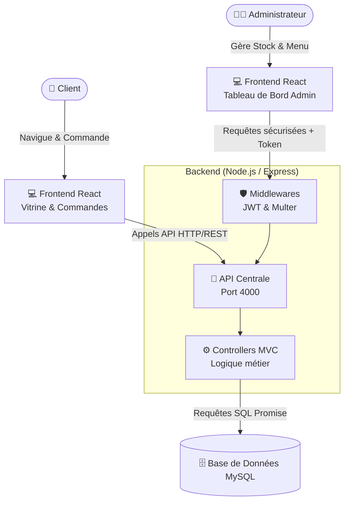

# ☕ Coffee Shop Management Platform


Une solution complète "Fullstack" de gestion et de vitrine pour un café / restaurant. Ce projet est divisé en trois parties principales : une interface client élégante, un tableau de bord administrateur complet, et une API backend robuste.

## 🔗 Live Demo
* **🌍 Site Client (Vitrine & Menu) :** [(https://coffee-shop-platform-client.vercel.app](https://coffee-shop-platform-sepia.vercel.app/)) *(lien à remplacer par 

---

## 🏗️ Architecture Diagram

L'application suit une architecture moderne découplée (Client/Serveur) basée sur l'architecture MVC pour le backend :



---

## 🌟 Fonctionnalités

### 📱 Côté Client (Frontend)
- **Menu Interactif :** Parcourez les cafés, thés, pâtisseries, crêpes et jus. *(Version statique sans backend disponible !)*
- **Réservation de Tables :** Réservez votre place et indiquez vos requêtes spéciales.
- **Gestion de Profil :** Inscription, connexion sécurisée et modification du profil.
- **Historique de Commandes :** Ajoutez des produits au panier et passez des commandes depuis la table.
- **Design Responsive :** Interface moderne, belle et adaptée aux mobiles.

### 💼 Côté Administrateur (Dashboard)
- **Tableau de Bord :** Vue d'ensemble des statistiques (revenus, commandes, réservations, alertes de stock faible).
- **Gestion du Menu & des Packs :** Ajoutez, modifiez ou supprimez des produits et créez des offres groupées.
- **Gestion des Stocks :** Suivez en temps réel la consommation de vos ingrédients.
- **Gestion des Commandes :** Validez les commandes et encaissez les paiements.
- **Gestion des Réservations & Événements :** Acceptez/Refusez les réservations. Le système ferme automatiquement les événements si la capacité maximale est atteinte !

### ⚙️ Côté Backend (API)
- **Architecture MVC :** Code propre, modulaire et évolutif (Modèle-Vue-Contrôleur).
- **Sécurité :** Authentification par Token JWT et mots de passe hachés avec `bcrypt`.
- **Uploads d'Images :** Gestion locale des images du menu et des événements via `multer`.
- **Base de Données Relationnelle :** Schéma MySQL complet et optimisé.

---

## 📂 Structure du Projet

```text
coffee-shop-platform/
├── client/          # Application React (Vitrine Client)
├── admin/           # Application React (Tableau de bord Administrateur)
├── server/          # API Node.js & Express (Backend centralisé)
├── coffee_shop.sql  # Fichier d'export de la base de données MySQL
└── .github/         # Pipelines CI/CD (GitHub Actions)
```

---

## 🚀 Installation & Lancement Local

### Prérequis
- [Node.js](https://nodejs.org/) (v18+)
- [XAMPP](https://www.apachefriends.org/) ou un serveur MySQL local.

### 1. Base de données
1. Lancez Apache et MySQL via XAMPP.
2. Allez sur `http://localhost/phpmyadmin`.
3. Créez une nouvelle base de données nommée `coffee_shop`.
4. Importez le fichier `coffee_shop.sql` fourni à la racine du projet.

### 2. Démarrer le Backend (API)
Ouvrez un terminal dans le dossier `server/` :
```bash
cd server
npm install
# Créez un fichier .env (voir la section Configuration)
npm run dev
```
*L'API tournera sur `http://localhost:4000`*

### 3. Démarrer le Client
Ouvrez un second terminal dans le dossier `client/` :
```bash
cd client
npm install
npm start
```
*Le site client tournera sur `http://localhost:3000`*

### 4. Démarrer l'Admin
Ouvrez un troisième terminal dans le dossier `admin/` :
```bash
cd admin
npm install
npm start
```
*Le tableau de bord tournera sur `http://localhost:3001`*
*(Identifiants admin par défaut : `admin@admin.com` / `admin`)*

---

## 🔐 Configuration (`.env`)
Dans le dossier `server/`, créez un fichier `.env` avec le contenu suivant :
```env
PORT=4000
DB_HOST=localhost
DB_USER=root
DB_PASSWORD=
DB_NAME=coffee_shop

JWT_SECRET=mon_super_secret_jwt_a_changer
SESSION_SECRET=mon_super_secret_session_a_changer
```

---

## 🌐 Déploiement en Production

Ce projet est conçu pour être facilement déployé sur le cloud :

1. **Frontends (`client` et `admin`) :** Peuvent être déployés gratuitement sur [Vercel](https://vercel.com/) ou Netlify. L'intégration continue (CI) est déjà configurée. *(Note: Le site client contient un mode "statique" qui permet d'afficher le menu complet sans avoir besoin du backend).*
2. **Base de données :** Peut être hébergée sur des services comme Clever-Cloud, Aiven, ou PlanetScale.
3. **Backend (`server`) :** Idéalement déployé sur Render.com ou Railway.app. N'oubliez pas d'y configurer vos variables d'environnement !

---

## 🛠️ Technologies Utilisées
- **Frontend :** React.js, TailwindCSS, Axios, React-Router
- **Backend :** Node.js, Express.js
---

## 👨‍💻 Auteur

**Mahmoud BH**
- GitHub : [@mahmoudBH](https://github.com/mahmoudBH)
- N'hésitez pas à me contacter si vous avez des questions sur ce projet ou si vous souhaitez collaborer !

---
*Si vous aimez ce projet, n'hésitez pas à laisser une ⭐ sur le repo !*
